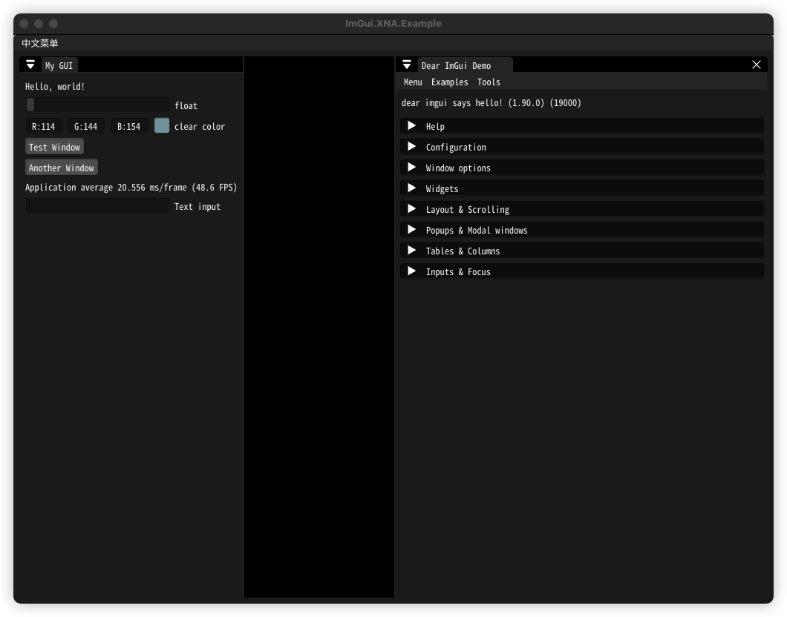

# ImGui.XNA.Example

- [ImGui.NET](https://github.com/ImGuiNET/ImGui.NET)
- [MonoGame](https://github.com/MonoGame/MonoGame)

由于 ImGui.NET 官方仓库中的示例在 M1 上运行一直存在问题, 本仓库重新调整了一下, 并增加了 NotoMonoCJK 作为默认字体

